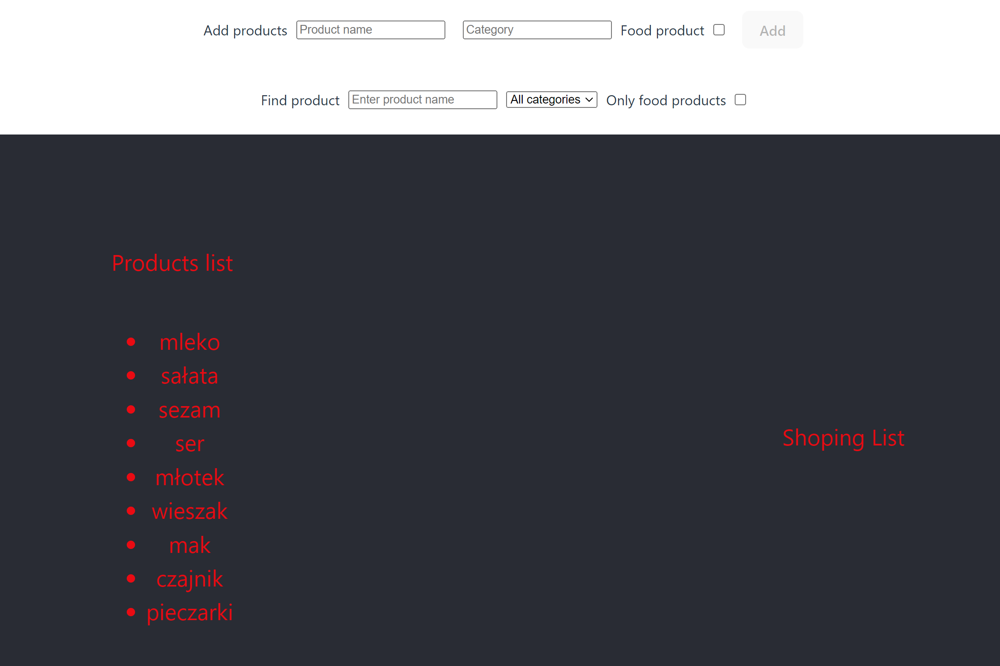
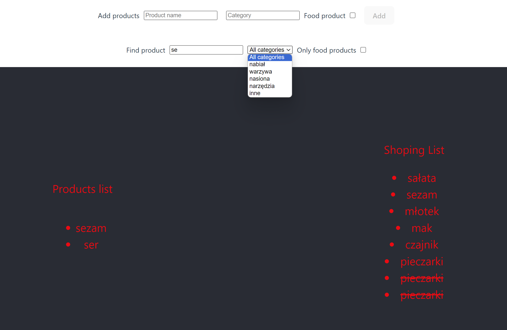

# Zakupownik - Aplikacja do Planowania Zakupów

## 

Aplikacja "Zakupownik" to prosty pomocnik w organizacji i realizacji zakupów. Pozwala na dodawanie produktów do listy zakupów, filtrowanie dostępnych produktów oraz śledzenie zakupów. Aplikacja została zbudowana przy użyciu React.

## Funkcjonalności

### 1. Dodawanie Dostępnych Produktów:

- Sekcja "AddProducts" umożliwia dodawanie dostępnych produktów.
- Każdy produkt ma określoną nazwę, kategorię i informację, czy jest to produkt spożywczy.

### 2. Filtrowanie Dostępnych Produktów:

- Sekcja "ProductsFilters" pozwala na filtrowanie dostępnych produktów.
- Możliwość filtrowania po nazwie (lub jej części) oraz kategorii produktu.
- Dodatkowo, dostępny jest filtr "Tylko produkty spożywcze".

### 3. Wyświetlanie Dostępnych Produktów:

- Lewa kolumna, "ProductsList", prezentuje dostępne produkty w formie listy.
- Kliknięcie lewym przyciskiem myszy dodaje produkt do listy zakupów.
- Kliknięcie prawym przyciskiem myszy na elemencie listy zakupów usuwa go.

### 4. Lista Zakupów:

- Prawa kolumna, "ShoppingList", wyświetla produkty dodane do listy zakupów.
- Kliknięcie prawym przyciskiem myszy na elemencie przekreśla go, kolejne kliknięcie przywraca normalny stan.
- Kliknięcie lewym przyciskiem myszy usuwa produkt z listy zakupów.

### 5. Dodawanie Nowych Produktów:

- Sekcja "AddProducts" pozwala na dodawanie nowych produktów do listy dostępnych.
- Nowe produkty są w pełni interaktywne i podlegają filtrowaniu oraz dodawaniu do listy zakupów.

## Podsumowanie

Aplikacja "Zakupownik" ułatwia codzienne zakupy poprzez intuicyjne dodawanie, filtrowanie i śledzenie produktów. Prosta w obsłudze, pozwala na szybką organizację zakupów i skupienie się na najważniejszych produktach.

## Widok

